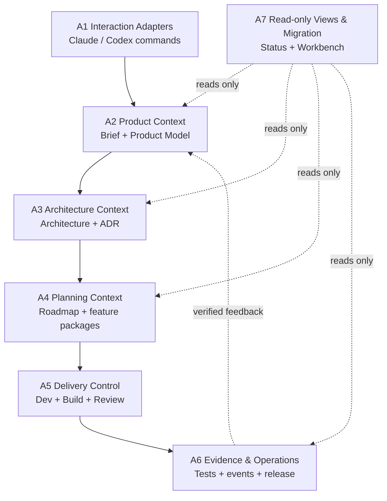

# Architecture Backbone

> 状态：active
> Architecture ID：ARCH-VNEXT-001
> Product Brief ID：PB-VNEXT-001
> Product Model ID：PM-VNEXT-001
> Product Model：`product-model.md`
> Roadmap：`roadmap.md`
> ADR：`.claude/workspace/decisions/2026-07-11-vnext-architecture.md`
> 更新于：2026-07-11

## 架构目标

让 AI 团队从产品理解到运行证据保持单向、可追溯的主干：每一层只拥有自己的事实；下游可以读取上游，不能反过来以实现细节重写产品或架构事实。

## 架构总览



## 组件与边界

| Architecture Component ID | 组件 | 职责 | 可读取 | 禁止拥有或直接修改 |
|---|---|---|---|---|
| A1 | Interaction Adapters | Claude/Codex 命令入口、平台适配与生成同步 | 上游全部事实源 | 产品、架构、任务或运行状态的第二份事实 |
| A2 | Product Context | Product Brief、Product Model、产品决策与范围判断 | Owner 输入、已验证反馈 | 架构模块、roadmap 状态、实现任务 |
| A3 | Architecture Context | 架构组件、依赖方向、接口、数据流、安全边界与 ADR | A2 | 产品优先级、feature task 状态、运行事件 |
| A4 | Planning Context | roadmap、feature spec/tasks、引用链和执行范围 | A2、A3 | 产品定义、架构决策、测试或发布事实 |
| A5 | Delivery Control | 开发门禁、实现、测试、审查与修复循环 | A2、A3、A4 | 静默扩大产品或架构边界 |
| A6 | Evidence & Operations | tests、events、review/release evidence、运行保障 | A2-A5 的已交付事实 | 以事件或看板反向成为产品/架构事实源 |
| A7 | Read-only Views & Migration | status、Workbench、legacy 兼容与迁移展示 | A2-A6 | 写入主线事实或定义产品优先级 |

## 关键接口

| 接口 | 输入 | 输出 | 所有者 |
|---|---|---|---|
| Product Context | Owner 输入、已确认决策、已验证反馈 | Capability ID、Journey ID、边界、成功标准 | A2 |
| Architecture Context | Capability/Journey、约束、风险 | Architecture Component ID、依赖、接口、数据流、安全边界、ADR | A3 |
| Planning Context | Capability/Journey、Architecture Component ID、模块目标 | roadmap/spec/tasks 引用、范围、验收和执行顺序 | A4 |
| Delivery Evidence | 已批准 plan、实现与验证输出 | 测试、review/release report、events、已验证反馈 | A5/A6 |
| View Projection | 只读主线事实与证据 | status/Workbench 展示 | A7 |

## 数据与控制流

### 从想法到交付

```text
Owner input
  -> A1 routes request
  -> A2 confirms product result and boundary
  -> A3 defines component and dependency impact
  -> A4 creates traceable module/spec/tasks
  -> A5 builds, tests and reviews
  -> A6 records evidence and operation readiness
```

### 从反馈到安全修改

```text
Observed feedback or incident
  -> A6 records verified evidence
  -> A2 classifies product/Journey impact
  -> A3 identifies affected components and compatibility risk
  -> A4 updates plan references
  -> A5 applies and verifies the change
```

Evidence may trigger analysis but never mutates Product Brief, Product Model or Architecture automatically.

## 依赖与演进规则

1. 正向依赖固定为 A1 -> A2 -> A3 -> A4 -> A5 -> A6；A7 只读投影。不得通过 A7 或 A6 绕过上游决策。
2. 每个 roadmap 模块必须映射 Capability ID 和 Architecture Component ID；每个 feature spec 必须引用 Capability ID、Journey ID、Architecture Component ID。N4 负责把此规则变成统一模板和自动校验。
3. 影响 A2/A3 边界、跨组件接口、安全边界、兼容策略或迁移策略的变更必须先写 ADR；普通局部实现不需要 ADR。
4. 兼容层只能位于 A1 或 A7，必须声明来源、目标、退出条件和移除模块；不得把 legacy 读取规则扩散到 A2-A6。
5. 组件之间通过声明的 artifact/interface 传递事实，不直接修改另一组件的内部文件。

## 安全边界

- A1 不能把凭据、个人数据或未脱敏外部输入写入规划 artifact。
- A2/A3 只保存决策与约束，不保存密钥、token 或运行时秘密。
- A5 只能执行经批准的范围；认证、授权、加密、支付、权限和数据迁移必须把风险交给 A3/A6 处理。
- A6 承担发布、监控、备份、恢复和回滚证据；N7 决定详细门禁。
- A7 不执行写操作，不以缓存、指标或 legacy 文档覆盖当前事实源。

## 迁移与兼容

- 当前旧 status/Workbench 读取链只属于 A7 兼容视图，已知会显示 M6 主线，不能作为 N1-N3 的状态判断依据。
- N4 定义新旧 artifact 的读取优先级；N8 验证迁移、切换 A7 的投影来源并清理过期兼容层。
- 任何删除或替换 source-of-truth 的动作须保留决策、迁移路径和回滚说明。

## 架构风险

| 风险 | 缓解 |
|---|---|
| 角色文档变成多个事实源 | 角色只定义行为；产品、架构、规划和证据分别由 A2-A6 拥有 |
| 以 Workbench/metrics 取代产品主线 | A7 明确只读，N8 前不扩大其功能范围 |
| 架构图只停在抽象层 | 用 Component ID 映射 roadmap，后续 spec 必须引用组件与 journey |
| 兼容层长期不退出 | 每个兼容层记录退出条件，N8 审查并移除 |
